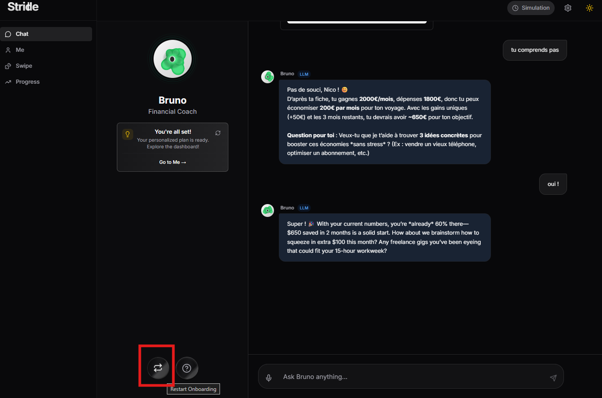
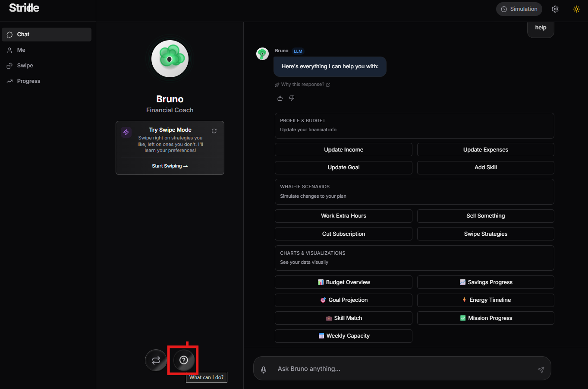
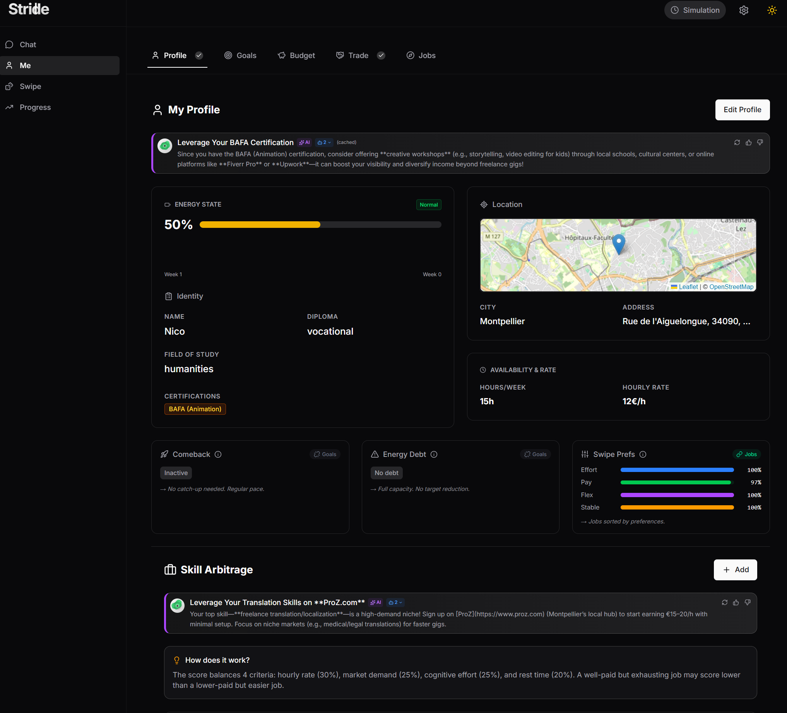
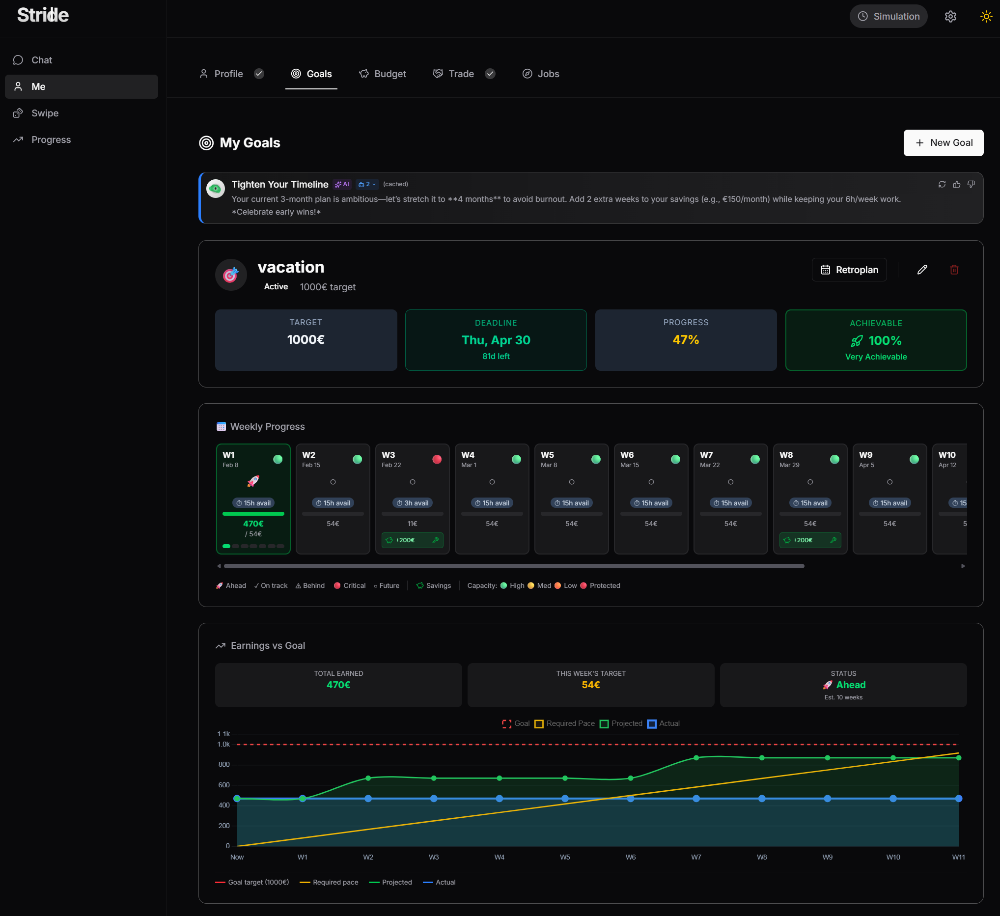
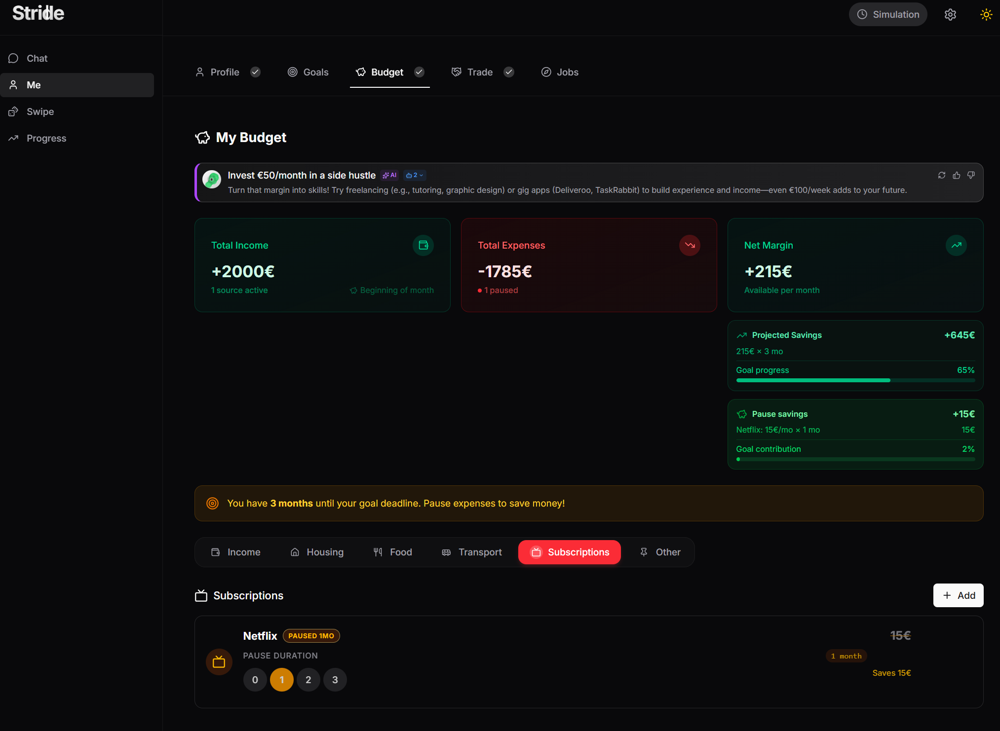
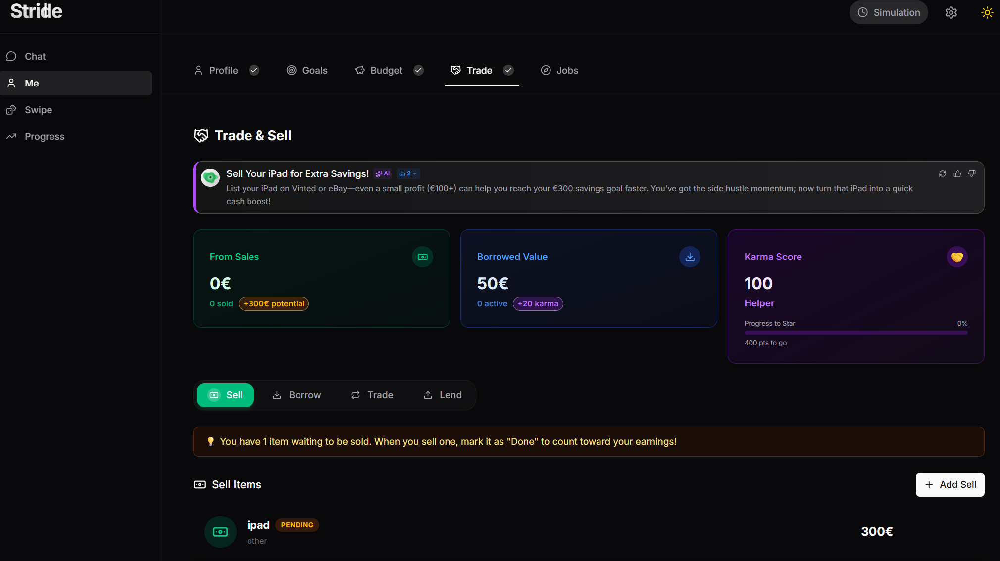
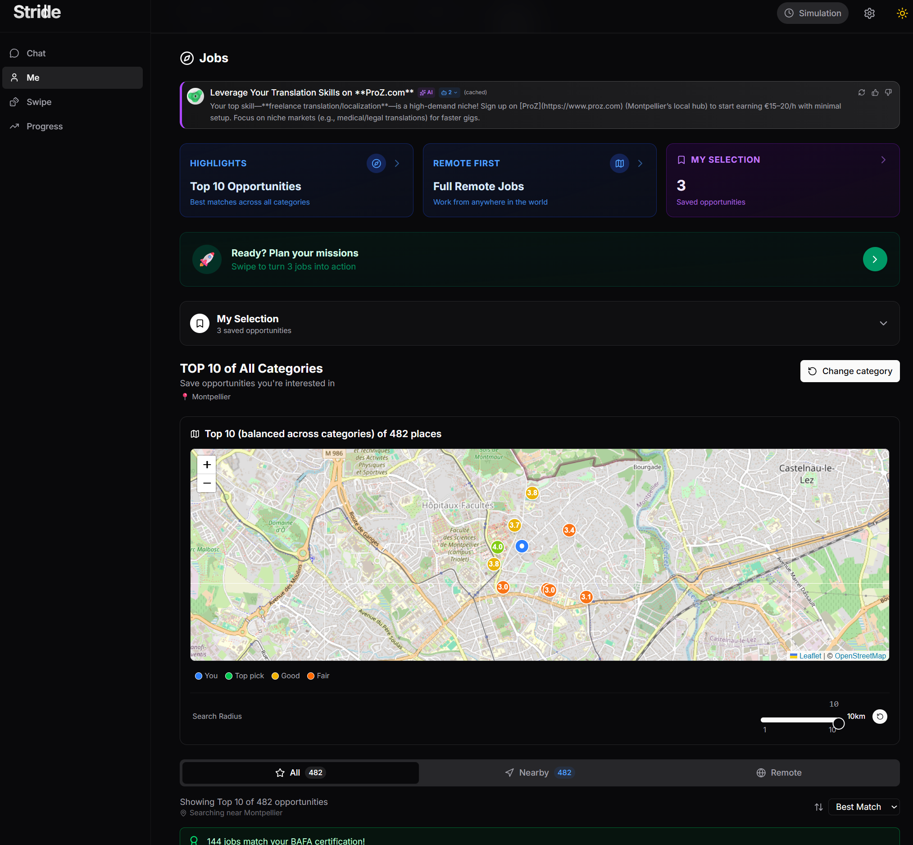
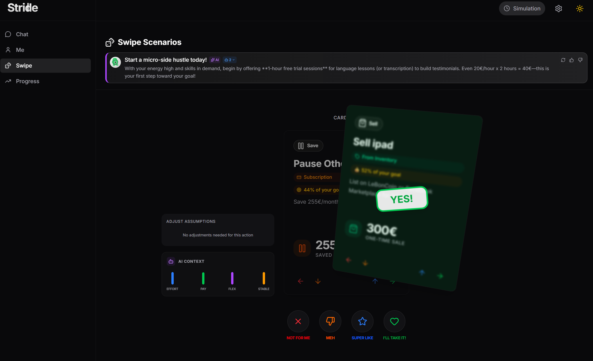
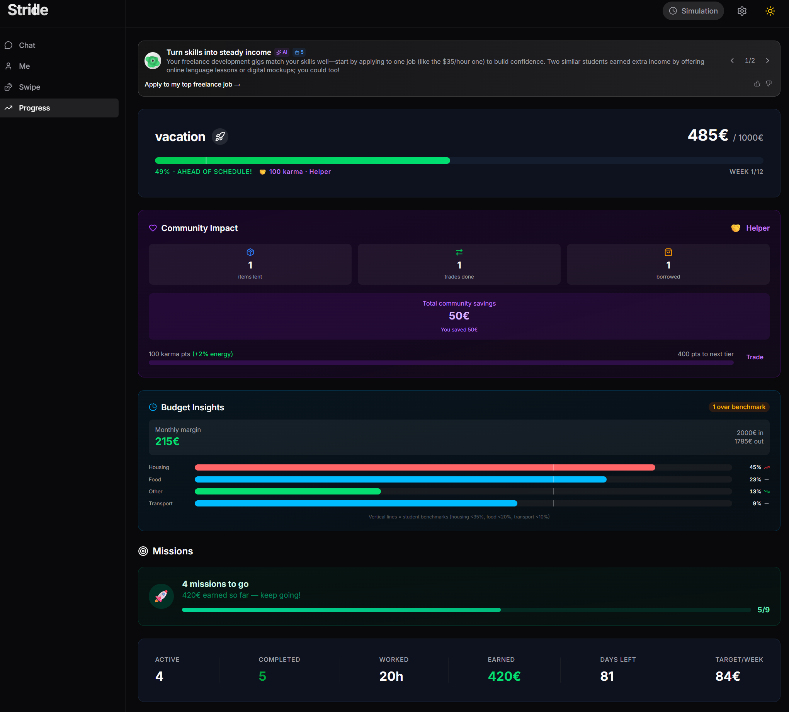
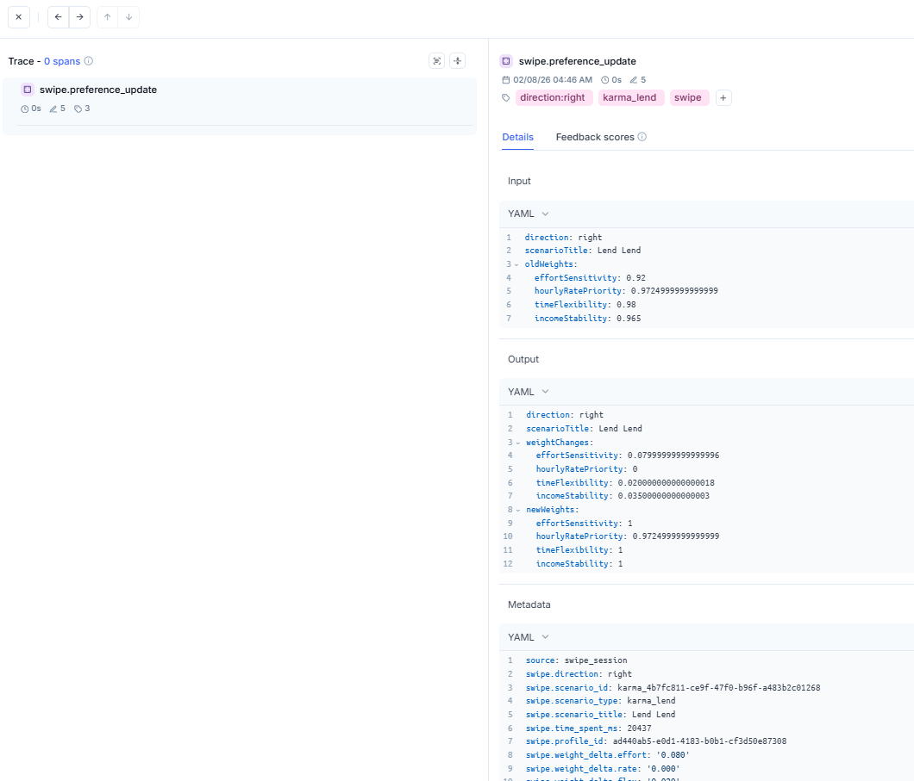

# Stride

> Navigate student life, one smart step at a time

**Live Demo**: [https://encodeclubhackathon2026-production.up.railway.app/](https://encodeclubhackathon2026-production.up.railway.app/)

**Track**: Financial Health — [Encode Club](https://www.encodeclub.com/) Hackathon 2026
**Sponsors**: [Comet (Opik)](https://www.comet.com/), [Google DeepMind](https://deepmind.google/), [Vercel](https://vercel.com/)

> **About the demo:** Stride is designed as a **privacy-first personal app** — there is no authentication system (out of scope for this hackathon). The live demo runs on a single shared instance, which means **all visitors share the same profile data**. Feel free to explore, but be aware that others may be using it at the same time. The demo uses **Mistral** (`ministral-3b-2512`) as LLM and **Mistral Voxtral** (`voxtral-mini-2602`) for speech-to-text. API keys are currently active but will be deactivated after the hackathon. The Google Maps API key expires on **February 19, 2026** — after that date, the Jobs tab will not return location results. If you run Stride locally, please use your own Google Maps API key (see `.env.example`).

> **Prior work disclosure:** All application code in this repository was written during the hackathon. The following open-source (MIT) packages were developed by the same author **before** the hackathon and are used as dependencies:
> - [deposium_embeddings-turbov2](https://github.com/theseedship/deposium_embeddings-turbov2) — Inference and embedding engine (optional companion service)
> - [@seed-ship/duckdb-mcp-native](https://www.npmjs.com/package/@seed-ship/duckdb-mcp-native) — DuckDB native bindings for MCP
> - [@seed-ship/mcp-ui-solid](https://www.npmjs.com/package/@seed-ship/mcp-ui-solid) — SolidJS UI components for MCP (extended during the hackathon to improve visualizations)

---

## 30 Second Pitch

You set a **savings goal** — say, $800 for a new laptop by June. Stride then proactively helps you reach it by surfacing income opportunities you might overlook: side jobs that match your skills, items you could sell, strategies you haven't considered — especially useful when you're new to a city or campus and don't know what's available yet.

4 intelligent features make this work:

1. **Skill Arbitrage** — Finds the job that won't burn you out. A $22/h SQL gig can beat $25/h Python when you factor in effort, demand, and rest.
2. **Swipe Scenarios** — Swipe through AI-generated strategies like on Tinder. The app learns your preferences and adapts.
3. **Comeback Mode** — Detects when you recover after exams and creates a realistic catch-up plan.
4. **Energy Debt** — Automatically reduces your targets when you're exhausted, and rewards self-care with achievements.

Every recommendation is traced in [Opik](https://www.comet.com/opik) — you can see exactly why the AI suggested that job, that strategy, or that adjustment.

---

## How It Works

### Chat — Onboarding with Bruno (`/`)

Bruno, your AI financial coach, guides you through onboarding via conversation. He extracts your profile, budget, and goals from natural language. Use the **restart** button to reset, or type **help** to see all available actions.

| Restart onboarding | Help — all available actions |
|---|---|
|  |  |

### Me Page — 5 Tabs (`/me`)

| Tab | What you do |
|-----|-------------|
| **Profile** | Personal info, energy tracking, work preferences, skill arbitrage |
| **Goals** | Savings goal with deadline, weekly progress chart, retroplanning |
| **Budget** | Monthly income/expenses, subscription optimization |
| **Trade** | Borrow/lend/swap items instead of buying (earns karma) |
| **Jobs** | Job search with Google Places, save leads |

| Profile | Goals |
|---|---|
|  |  |

| Budget | Trade |
|---|---|
|  |  |

| Jobs (Google Places) |
|---|
|  |

### Swipe Scenarios (`/swipe`)

Roll the dice to get personalized scenarios based on your profile. Swipe right = interested, left = not interested. The app learns your preferences (effort sensitivity, rate priority, flexibility). After confirming, scenarios become missions to track on the Progress page.



### Progress Dashboard (`/progress`)

Daily mood check-in, timeline with weekly targets, comeback alerts, energy history, missions to validate/skip/delete, and Bruno Tips with contextual advice.



### Settings (`/settings`)

LLM/STT provider config, API keys, server status indicators. Switch providers at runtime without restarting.

### Time Machine (Demo Feature)

Simulation controls let you fast-forward time to test energy debt triggers, comeback scenarios, and achievement unlocks without waiting weeks. Access via the clock icon in the Progress page header.

---

## 4 Key Features

### 1. Skill Arbitrage

The highest-paying job isn't always the best. Multi-criteria scoring:

```
Score = Rate (30%) + Demand (25%) + Effort (25%) + Rest (20%)
```

A $22/h SQL job might score higher than $25/h Python if it's less exhausting and more in-demand.

### 2. Swipe Scenarios

- Swipe right = interested, left = not interested
- After 4+ swipes, the app updates your preference weights
- Weights influence future job recommendations
- All preference updates traced in Opik

### 3. Comeback Mode

- Detects when energy rises >80% after being <40%
- Creates a realistic catch-up plan
- "Comeback King" achievement unlocked

### 4. Energy Debt

- 3+ weeks at low energy = automatically reduced goal
- "Self Care Champion" badge unlocked
- Rest mode suggestions activated

---

## Karma System

Community contribution through sharing economy. Karma tracks your positive impact:

| Action | Karma Points |
|--------|--------------|
| Completed lend | +1 |
| Completed trade/swap | +1 |

**Karma Tiers:**

| Tier | Threshold | Benefit |
|------|-----------|---------|
| Helper | 2+ karma | Unlocks "Community Helper" achievement |
| Champion | 5+ karma | Unlocks "Sharing Champion" achievement |
| Legend | 10+ karma | Unlocks "Karma Legend" achievement |

**Energy Bonus:** +2% energy per karma point (capped at +10%)

Bruno Tips adapt based on your karma level, celebrating community contributions.

---

## Achievements System

Gamification layer with bronze/silver/gold tiers:

| Achievement | Tier | Condition |
|-------------|------|-----------|
| First Euro | Bronze | First earnings collected |
| 100 Club | Silver | Reach 100 euros earned |
| Week Complete | Bronze | Complete all weekly missions |
| Goal Achieved | Gold | Reach savings goal |
| Self Care Champion | Silver | Use rest mode during energy debt |
| Comeback King | Gold | Complete comeback plan |
| Stable Energy | Silver | Maintain energy above 60% for 4 weeks |
| Budget Master | Silver | Apply 3+ optimizations |
| Skill Arbitrage Pro | Bronze | Use multi-criteria job selection |
| Diversified Income | Silver | Have 3+ active income sources |
| Swipe Master | Bronze | Complete swipe session |
| Profile Complete | Silver | Complete all 5 tabs |
| Daily Check | Bronze | 7 days consecutive energy updates |
| Community Helper | Bronze | Reach 2 karma points |
| Sharing Champion | Silver | Reach 5 karma points |
| Karma Legend | Gold | Reach 10 karma points |

---

## Architecture

### 18 Agents (Mastra Framework)

**Core Agents (Factory):**

| Agent | Role |
|-------|------|
| **Budget Coach** | Budget analysis, personalized advice |
| **Job Matcher** | Skill Arbitrage scoring, job recommendations |
| **Guardian** | 2-layer validation of recommendations |
| **Money Maker** | Income opportunity detection (sellable items, side hustles) |
| **Strategy Comparator** | Scenario comparison and ranking |
| **Projection ML** | Future earnings projections |
| **Goal Planner** | Savings plan creation and progress tracking |

**Specialized Agents:**

| Agent | Role |
|-------|------|
| **Onboarding Agent** | Profile extraction from chat |
| **Lifestyle Agent** | Subscription optimization |
| **Swipe Orchestrator** | Scenario generation + preference learning |
| **Daily Briefing** | Contextual daily tips generation |
| **Tips Orchestrator** | Bruno tips prioritization and routing |
| **Tab Tips Orchestrator** | Tab-specific tips with warmup and prefetch |
| **Agent Executor** | Agent dispatch coordinator |

**Guardrail Agents (Swipe Pipeline):**

| Agent | Role |
|-------|------|
| **Essential Guardian** | Detect naive suggestions, propose structural alternatives |
| **Ghost Observer** | Detect rejection patterns, filter by behavioral insights |
| **Asset Pivot** | Detect productive assets, suggest monetization |
| **Cash Flow Smoother** | Detect timing mismatches, suggest timing solutions |

### Tech Stack

| Component | Technology |
|-----------|------------|
| **Tracing** | Opik Cloud (every recommendation traced) |
| **LLM** | 3 tested providers: Groq (dev), Mistral (SLM exploration), Google Gemini 2.5 Flash |
| **Voice (STT)** | Groq Whisper (`whisper-large-v3-turbo`) or Mistral Voxtral (`voxtral-mini-2602`) |
| **Embeddings** | [Turbov2](https://github.com/theseedship/deposium_embeddings-turbov2) (optional) |
| **Agents** | Mastra Framework |
| **Frontend** | SolidStart + SolidJS + TailwindCSS |
| **Storage** | DuckDB (single file) |
| **Job Search** | Google Places API |

### Companion Service: Turbov2 Embeddings

For **RAG features** (semantic search, similar profiles), Stride uses an external embeddings service:

**Repository**: [theseedship/deposium_embeddings-turbov2](https://github.com/theseedship/deposium_embeddings-turbov2)

| Feature | Model | Speed |
|---------|-------|-------|
| **Embeddings** | m2v-bge-m3-1024d | 14k texts/sec |

**Quick Setup (local dev):**

```bash
# Clone and run Turbov2
git clone https://github.com/theseedship/deposium_embeddings-turbov2.git
cd deposium_embeddings-turbov2
pip install -r requirements.txt
python -m uvicorn src.main:app --host 0.0.0.0 --port 11436

# In Stride .env
OLLAMA_URL=http://127.0.0.1:11436
EMBEDDING_MODEL=m2v-bge-m3-1024d
EMBEDDINGS_ENABLED=true
```

**Railway Deployment:**

Both services deploy to Railway. Configure internal networking:

```bash
# Stride .env (Railway)
OLLAMA_URL=http://deposium-embeddings-turbov2.railway.internal:11435

# Turbov2 .env (Railway) - minimal config
UVICORN_PORT=11435
DEFAULT_EMBEDDING_MODEL=m2v-bge-m3-1024d
```

> **Note**: Stride works without Turbov2—RAG features gracefully degrade. Only enable `EMBEDDINGS_ENABLED=true` when the service is running.

### Opik Integration

Every recommendation is traced with prompt versioning:

| Trace | What it captures |
|-------|------------------|
| `chat.onboarding` | Profile extraction with prompt hash |
| `skill_arbitrage` | Job scoring breakdown |
| `swipe.preference_update` | Weight deltas after swipes |
| `guardian_validation` | Risk checks on recommendations |
| `comeback.detection` | Energy recovery detection |
| `energy_debt.check` | Fatigue threshold monitoring |
| `feedback.score` | User satisfaction from interactions |

Traces include `prompt.name`, `prompt.version`, `prompt.hash` for regression detection.

| Chat trace with feedback scores | Swipe preference update trace |
|---|---|
|  |  |

---

## Quick Start

```bash
# 1. Install dependencies
pnpm install

# 2. Set environment variables
cp .env.example .env
# Edit .env with:
#   LLM_API_KEY + LLM_BASE_URL + LLM_MODEL (required - any OpenAI-compatible provider)
#   OPIK_API_KEY + OPIK_WORKSPACE (recommended - tracing)
#   GOOGLE_MAPS_API_KEY (optional - Jobs tab search)

# 3. Run development server
pnpm run dev              # Frontend → http://localhost:3006

# 4. Build for production
pnpm build
```

### Supported LLM Providers

| Provider | Base URL | Example Model |
|----------|----------|---------------|
| **Groq** | `https://api.groq.com/openai/v1` | `llama-3.1-8b-instant` |
| **Mistral** | `https://api.mistral.ai/v1` | `ministral-3b-2512` |
| **Google Gemini** | `https://generativelanguage.googleapis.com/v1beta/openai/` | `gemini-2.5-flash` |
| **OpenAI** | `https://api.openai.com/v1` | `gpt-4o-mini` |
| **OpenRouter** | `https://openrouter.ai/api/v1` | `anthropic/claude-3-haiku` |
| **Together** | `https://api.together.xyz/v1` | `meta-llama/Llama-3-8b-chat-hf` |

Just set `LLM_API_KEY`, `LLM_BASE_URL`, and `LLM_MODEL` in your `.env` to switch providers.

Providers can also be switched **at runtime** via the Settings page (`/settings`) without restarting the server.

### Supported STT (Speech-to-Text) Providers

| Provider | Base URL | Model |
|----------|----------|-------|
| **Groq Whisper** | `https://api.groq.com/openai/v1` | `whisper-large-v3-turbo` |
| **Mistral Voxtral** | `https://api.mistral.ai/v1` | `voxtral-mini-2602` |

STT is used for voice input in the onboarding chat. Configure via `STT_API_KEY`, `STT_BASE_URL`, `STT_MODEL` in `.env` or via `/settings`.

### Deployment Note

> **Vercel / Netlify / Cloudflare Pages won't work.** Stride uses DuckDB, a native C++ module that requires a persistent filesystem. Serverless platforms use ephemeral containers — the database file would be lost on every cold start. Use a **VM-based host** like Railway, Fly.io, Render, or a VPS (DigitalOcean, Hetzner).

### Full Stack (with RAG/Embeddings)

```bash
# Terminal 1: Start Turbov2 embeddings service
cd ../deposium_embeddings-turbov2
python -m uvicorn src.main:app --port 11436

# Terminal 2: Start Stride
cd ../encode_club_hackathon_2026
EMBEDDINGS_ENABLED=true pnpm run dev
```

---

## Development

```bash
pnpm run dev              # Run frontend
pnpm run dev:mcp          # Run MCP server (stdio)
pnpm typecheck        # Type check all packages
pnpm lint             # Lint all packages
pnpm lint:fix         # Lint with auto-fix
pnpm format           # Format with Prettier
```

---

## Documentation

- [CLAUDE.md](CLAUDE.md) - AI assistant guidelines
- [docs/architecture/](docs/architecture/) - Architecture details
- [docs/ROADMAP.md](docs/ROADMAP.md) - Project roadmap

---

## Future Development

### Community & Social Layer

Your financial data stays on your device. Only your inventory, trades, and karma are visible to the community. **Data sovereignty by design.**

The existing data model already supports 4 trade types with karma scoring:

| Action | Karma | Today (solo) | Tomorrow (community) |
|--------|-------|--------------|----------------------|
| **Sell** | 0 pts | List on Vinted/LeBonCoin | Campus marketplace listing |
| **Lend** | +50 pts | Self-declared | Match with borrower requests |
| **Borrow** | +20 pts | Self-declared | Browse campus board, request items |
| **Trade** | +30 pts | Skill/item exchange | Smart matching via RAG embeddings |

**What already exists:** Karma tiers (Newcomer → Helper → Star) with energy bonuses, swipe scenarios with karma categories, achievements ("Community Helper", "Sharing Champion", "Karma Legend"), and full trade lifecycle (`pending → active → completed`).

**Roadmap:**
1. **Campus Board** — Simulated feed of nearby students with available items
2. **Karma Collateral** — Borrowing locks karma points (returned when item returned on time)
3. **Smart Matching via RAG** — Semantic similarity to match needs against campus inventory
4. **Multi-user with MotherDuck** — Real authentication (university email), real-time campus board

### TabPFN 2.5 (ML Enhancement)

[TabPFN](https://github.com/PriorLabs/TabPFN) could replace rule-based algorithms with probabilistic predictions: burnout risk with confidence scores, non-linear swipe preference learning, and 7-day energy forecasting. Fits Stride's tiny datasets (14-50 samples) with zero-shot learning and no GPU needed. See [docs/architecture/legacy/TabPFN-turbov2.md](docs/architecture/legacy/TabPFN-turbov2.md).

### Voice Expansion

Voice input (STT) is integrated in onboarding chat with Groq Whisper or Mistral Voxtral. Future: voice in all chat contexts, text-to-speech for Bruno responses, continuous dictation mode.

---

## License

MIT
